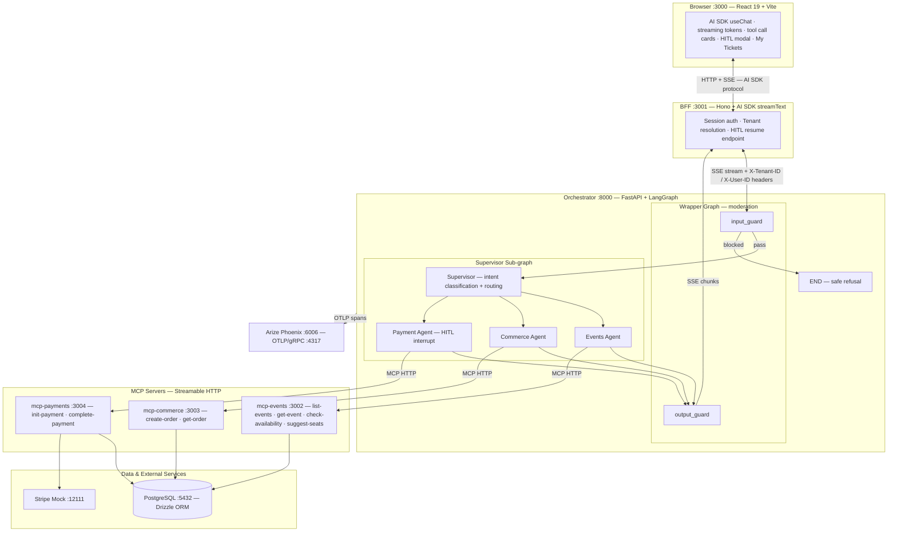

# Architecture

This document covers the system design, component responsibilities, and the key decisions made while building AI Ticket — including tradeoffs, deliberate simplifications, and known gaps.

---

## System Diagram

---

## Components

| Component | Runtime | Port | Role |
|---|---|---|---|
| `ui` | React 19 + Vite | 3000 | Streaming chat UI, tenant switcher, HITL payment modal, My Tickets order history |
| `bff` | Hono / Node.js | 3001 | Session auth, tenant resolution, AI SDK stream proxy, HITL resume |
| `mcp-events` | Node.js | 3002 | Event inventory tools (full implementation) |
| `mcp-commerce` | Node.js | 3003 | Order creation and retrieval (thin) |
| `mcp-payments` | Node.js | 3004 | Payment init and completion via Stripe (thin) |
| `orchestrator` | FastAPI / Python | 8000 | LangGraph supervisor + specialist agents + guardrails |
| `postgres` | PostgreSQL 16 | 5432 | All application data, two demo tenants |
| `stripe-mock` | stripe/stripe-mock | 12111 | Local Stripe API emulation |
| `phoenix` | Arize Phoenix | 6006 | Trace UI + OTLP collector |

---

## Key Decisions

### MCP as the only AI↔data boundary

Every agent calls tools exclusively over MCP — no agent queries the database directly. This makes the access boundary clean, auditable, and easy to reason about: if a capability doesn't exist as an MCP tool, no agent can exercise it. The Python orchestrator has zero database imports.

### LangGraph Supervisor + explicit wrapper graph for moderation

A `create_supervisor` sub-graph handles intent classification and routes to one of three specialist agents. The supervisor is wrapped in a second `StateGraph` with topology `START → input_guard → supervisor → output_guard → END`.

The wrapper was chosen over `pre_model_hook` / `post_model_hook` hooks because hooks return state updates and cannot short-circuit on flagged input — an explicit node can route directly to `END` via a conditional edge. This also makes the three stages show up as distinct spans in Phoenix rather than being folded into a single supervisor span.

### Provider-aware model profile registry

Each call site (supervisor, three specialist agents) declares a `ModelProfile` — a mapping from provider name to a `ProviderConfig` of `(model_id, params)`. `build_chat_model(settings, profile)` resolves the right entry at runtime based on `LLM_PROVIDER`.

This design was inspired by Vercel AI SDK's `customProvider` pattern. Provider-specific parameters (`reasoning_effort`, `use_responses_api` for OpenAI reasoning models) live inside the profile entry rather than being scattered across call sites.

**Two model tiers are defined:**

| Tier | OpenAI | Vercel AI Gateway |
|---|---|---|
| Base (agents) | `gpt-5.4-mini` | `google/gemini-3.1-flash-image-preview` |
| Better (supervisor) | `gpt-5.4` | `google/gemini-3.1-pro-preview` |

**Important caveats:**
- The `openai` provider path is the primary tested path. gpt-5 reasoning models with bound function tools require `/v1/responses` (`use_responses_api=True`).
- The `vercel` provider path (Gemini via gateway) is functional but not fully validated. The supervisor occasionally echoes content already provided by a sub-agent — a prompting issue specific to that model family that would need iteration to resolve before relying on it.

### Provider-aware moderation

Moderation does not follow the chat provider. A `Moderator` protocol has two implementations dispatched by `LLM_PROVIDER`:
- `openai` → OpenAI's native `/v1/moderations` endpoint (`omni-moderation-latest`)
- `vercel` → Vercel AI Gateway's `openai/gpt-oss-safeguard-20b` chat-completion classifier

The safeguard classifier is constrained to emit `{"flagged": bool}` JSON. Unparseable output fails closed — a malformed classifier response is treated as flagged, so it can never silently pass risky content through.

### Human-in-the-loop payment flow

The payment agent uses LangGraph's `interrupt()` to pause execution after `init-payment`. The BFF surfaces the pause as a `hitl_required` tool call event, which AI SDK forwards to the UI. The `PaymentConfirm` modal renders and input is frozen. On user approval, the BFF posts to `/hitl/resume`, which resumes the graph and calls `complete-payment`.

Note: `interrupt()` is implemented internally as a raised exception that LangGraph catches and persists. This causes HITL interrupt spans to appear red/errored in Phoenix — that is mechanical, not a real error.

### InMemorySaver for HITL state

The graph uses `InMemorySaver` as the LangGraph checkpointer rather than a Postgres-backed one. The compiled graph is cached at module level keyed by `(tenant_id, user_id)`, so `/hitl/resume` reaches the same in-memory checkpointer instance that `/chat` created.

`langgraph-checkpoint-postgres` was evaluated and dropped: the demo flow is ~60 seconds (well within memory lifetime), a second schema namespace in the Postgres container would complicate the database ownership story (currently cleanly owned by `packages/db`), and it adds infrastructure weight without changing anything visible in the demo. Tradeoff: state is lost on orchestrator restart. This would not be acceptable in production.

### AI SDK for BFF and frontend streaming

The BFF uses `streamText` from Vercel AI SDK to manage the SSE wire protocol, tool call lifecycle, and HITL pause/resume signals. The React frontend uses `useChat`, which handles streaming tokens, tool call result rendering, and error state without bespoke streaming infrastructure. The BFF is intentionally thin: session management, tenant resolution, and stream proxying only — no business logic.

### Session auth and multi-tenant isolation

Sessions are created at the BFF layer using Hono's cookie session middleware with a signed cookie. The tenant selector on first load hits `/auth/demo-login`, which creates a session carrying `{ userId, tenantId }`. The BFF injects these as `X-Tenant-ID` and `X-User-ID` headers on every downstream request to the orchestrator and MCP servers. All Drizzle queries in the MCP servers are scoped by `tenantId` from the header.

### `packages/db` as the single schema source of truth

The Drizzle schema lives in `packages/db/src/schema.ts`. Running `drizzle-kit export` produces `postgres/schema.sql`, which is committed and mounted into the Postgres container's `initdb.d/` directory — auto-executed on first boot. Each MCP server imports `@ai-ticket/db` as a workspace dependency and uses typed Drizzle query builders. The orchestrator has no database access at all.

### Full vs thin MCP servers

`mcp-events` is fully implemented — all four tools, complete Zod validation, happy-path Vitest tests. It is the reference implementation that establishes the pattern. `mcp-commerce` and `mcp-payments` are intentionally thin: minimum tools needed for the demo flow, no tests. The pattern is established once; repetition adds no signal.

### No shared types package

An earlier plan included an `@ai-ticket/types` package shared between BFF, UI, and (mirrored as Pydantic in) the orchestrator. It was dropped because the BFF is already the translation seam: the UI↔BFF boundary speaks the AI SDK wire protocol (typed by AI SDK itself), and the BFF↔orchestrator boundary is the BFF's parsing job. A shared TS package would only help the TS↔TS half of that boundary — the TS↔Python gap exists regardless. Each side owns its own types and updates independently when the wire shape changes.

### Observability with Arize Phoenix

`openinference-instrumentation-langchain` auto-instruments every LangGraph node, LLM call, moderation call, and MCP tool invocation as OpenTelemetry spans exported to a self-hosted Phoenix container. No cloud account required. Every span — supervisor routing, agent hops, MCP latency, token counts — is visible at `localhost:6006` alongside the running demo.

### My Tickets — order history in the chat header

The chat header exposes a "My Tickets" button that opens a dialog listing all orders for the current session. Orders are fetched from the BFF on dialog open (lazy, not on mount) and displayed with their real-time status:

- **Pending** — order created, payment not yet confirmed
- **Confirmed** — payment completed successfully
- **Cancelled** — order was cancelled

This makes the state transition visible without leaving the chat: after the agent books seats the order appears as Pending; after the user completes the HITL payment modal it flips to Confirmed. Each order card shows the event name, venue, date, individual seat positions and prices, and the total.

### LLM and prompt development workflow

Models and prompts were prototyped in a playground environment before being added to the codebase. Once integrated, a smoke test script (`scripts/smoke.sh`) was used to drive the full flow end-to-end and inspect the resulting traces in Phoenix. This allowed fast iteration on routing prompts and agent instructions without unit-testing every prompt variant.

---

## Known Gaps

These are deliberate scope cuts for a demo — not oversights. Each would need to be addressed before this could be considered production-ready.

**Frontend error handling.** Orchestrator and MCP errors surface as raw messages in the chat window. A production UI would distinguish network errors, payment failures, and out-of-stock events with specific copy and retry affordances. The AI SDK `error` state is wired up but not fully exploited in the UI layer.

**Vercel provider stability.** The `vercel` provider path works but is not fully validated against the full demo flow. The supervisor occasionally repeats content already streamed by a sub-agent. This is a prompting and model-specific issue, not an architectural one, but it would require iteration to resolve.

**Test coverage.** The pytest suite covers stream serialization, both moderation provider paths, and guardrail routing (22 tests). Supervisor intent classification and the HITL payment flow have no automated tests. A production system would need a fake-`ChatOpenAI` harness to test routing logic deterministically, and integration tests for the full HITL sequence.

**Agent capabilities are limited to the happy path.** The implemented flow covers browsing events, suggesting seats, creating an order, and completing payment. A production-grade assistant would need significantly more: order cancellation, seat map rendering by row and section, looking up orders from a previous session or by confirmation number, modifying quantities on an existing order, waitlisting for sold-out events, and multi-event cart flows. Each of these requires new MCP tools, updated agent instructions, and corresponding UI components — the architecture supports extension in all three layers, but none of it is built.

**Evals.** Offline evaluation with `phoenix.evals` was scoped out due to time constraints. For a production system, intent classification accuracy and end-to-end conversion correctness should be measured against a golden dataset on every significant model or prompt change. The infrastructure (Phoenix experiment API, fixtures format) is in place to add this.

**HITL durability.** The `InMemorySaver` checkpointer means HITL state is lost if the orchestrator restarts between `init-payment` and `complete-payment`. A `langgraph-checkpoint-postgres` checkpointer would make the flow durable across restarts.
